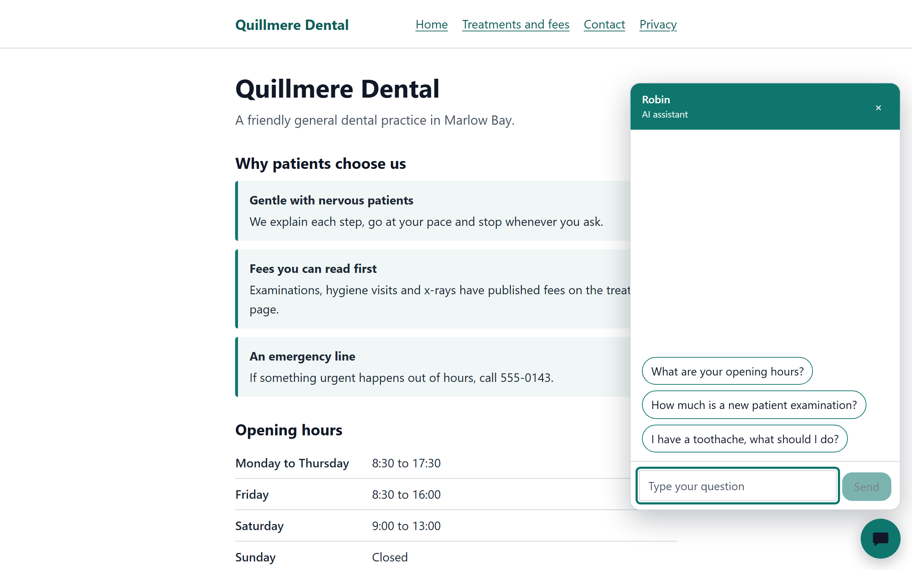

# next-chatbot-kit

[](https://github.com/CodeVertex55/next-chatbot-kit/actions/workflows/ci.yml)

A chat assistant you can copy into a small-business website built with Next.js. It answers visitors from facts you write down, streams replies from Claude through the Anthropic API, and can collect a callback request and send it to your email or any webhook.

It is for agencies who build sites for small businesses, and for owners who want a chat assistant on their own site. You pay Anthropic for the model calls you use. The kit itself is free under the MIT licence.

What is in the box:

- A chat widget with a launcher, a greeting bubble, suggestion chips, streaming replies and a stop button. The controls are labelled, focus moves into the chat when it opens, and Escape closes it.
- A chat route that checks the request, limits abuse and streams the reply as plain text.
- A callback form with three modes: required, optional or off. Leads go to email through Resend, to a webhook, or both.
- A system prompt builder. You write a content file about the business and a short config. The kit turns them into a prompt with rules that keep the assistant truthful.
- Guard rails: origin check, rate limits, an optional daily call limit, message validation and a safe fallback when the model fails.
- A demo site for a fictional dental practice, Quillmere Dental in Marlow Bay.

Demo: https://next-chatbot-kit-phi.vercel.app



Quillmere Dental is a fictional business. Any resemblance to a real practice is coincidental.

The assistant can be wrong. It is not a substitute for professional advice. See [Limits](#limits) before you put it on a real site.

## Quick start

You need Node 22 or newer.

```bash
npm install
cp .env.example .env.local
npm run dev
```

Open http://localhost:3000 and click the chat button in the corner.

With no `ANTHROPIC_API_KEY` set, the chat answers with a fixed holding reply that gives the phone number and email. Add a key to `.env.local` to get real answers:

```bash
ANTHROPIC_API_KEY=your-key-here
```

Leads from the callback form are written to the console as a one-line notice until you set up delivery. See [Lead delivery](#lead-delivery).

## Add it to your own site

These steps assume a Next.js app that uses the App Router and has the `@/*` path alias pointing at `src/*`, as in `tsconfig.json` here.

1. **Copy `src/chat` into your project** and add the one runtime dependency it needs:

   ```bash
   npm install @anthropic-ai/sdk
   ```

   The folder imports nothing from outside itself except npm packages. Server code is exported from `@/chat`. The widget is exported from `@/chat/widget`.

2. **Add the two routes.**

   `src/app/api/chat/route.ts`:

   ```ts
   import { createChatHandler } from "@/chat";
   import { business } from "@/content/business";
   import { chatConfig } from "@/chat.config";

   export const runtime = "nodejs";
   export const dynamic = "force-dynamic";
   export const POST = createChatHandler({ content: business, config: chatConfig });
   ```

   `src/app/api/chat/lead/route.ts`:

   ```ts
   import { createLeadHandler } from "@/chat";
   import { business } from "@/content/business";
   import { chatConfig } from "@/chat.config";

   export const runtime = "nodejs";
   export const dynamic = "force-dynamic";
   export const POST = createLeadHandler({ content: business, config: chatConfig });
   ```

3. **Write the content file** at `src/content/business.ts`. This is everything the assistant is allowed to know. The assistant is told not to state anything that is not in it.

   ```ts
   import type { BusinessContent } from "@/chat";

   const siteUrl = process.env.SITE_URL ?? "http://localhost:3000";

   export const business: BusinessContent = {
     name: "Example Bakery",
     description: "a family bakery in Springfield",
     siteUrl,
     phone: "555-0100",
     phoneHref: "tel:5550100",
     email: "hello@example-bakery.example",
     bookingUrl: `${siteUrl}/orders`,
     hours: [{ days: "Monday to Saturday", hours: "7:00 to 15:00" }],
     services: [{ name: "Sourdough loaf", summary: "Baked each morning.", price: "$7" }],
     pricingNote: "Custom cake prices are confirmed after a short chat with the bakers.",
     policies: [{ title: "Cake orders", text: "Please order three days ahead." }],
     faqs: [{ question: "Do you deliver?", answer: "No, pickup only." }],
     pages: [{ title: "Home", url: siteUrl }],
   };
   ```

   `src/content/business.ts` in this repo is a fuller example. The optional fields are `emergencyPhone`, `address`, `hoursNote`, `serviceArea` and `team`. `siteUrl` must be a full address, because the widget reads the host from it.

4. **Write the config** at `src/chat.config.ts`. Only a persona name, a greeting and at least one topic are required. Everything else has a default. See the [Config reference](#config-reference).

   ```ts
   import { defineChatConfig } from "@/chat";

   export const chatConfig = defineChatConfig({
     persona: { name: "Robin" },
     greeting: "Questions about our menu or opening hours? Ask here.",
     topics: ["menu", "opening hours", "orders"],
     extraRules: ["Never discuss allergens beyond the list on the allergen page."],
     leadMode: "optional",
     privacyUrl: "/privacy",
   });
   ```

   Read [Writing rules](docs/writing-rules.md) before you write `extraRules`.

5. **Mount the widget** once, in `src/app/layout.tsx`:

   ```tsx
   import { ChatWidget } from "@/chat/widget";
   import { toPublicConfig } from "@/chat";
   import { chatConfig } from "@/chat.config";
   import { business } from "@/content/business";

   // Inside the body of your root layout:
   <ChatWidget config={toPublicConfig(chatConfig, business)} />;
   ```

   `toPublicConfig` sends only the browser-safe part of the config. Of the limits it sends only `maxMessageChars` and `maxTurns`. Your `extraRules`, the other limits and the rest of the content file stay on the server. The widget posts to `/api/chat` and `/api/chat/lead`. Pass `chatEndpoint` or `leadEndpoint` to use other paths.

6. **Set the environment variables** in `.env.local` for development and in your host for production. See [Environment variables](#environment-variables) and [Deploy](docs/deploy.md).

Then run `npm run check:rules` with a key set. It sends test questions to the model and checks the replies against your content and rules.

## Config reference

`defineChatConfig` validates the input and throws a clear error when a value is wrong. The `limits` and `strings` objects are partial: set only the keys you want to change.

| Option                   | Default          | Notes                                                                                                                                                                                                                                                                                                            |
| ------------------------ | ---------------- | ---------------------------------------------------------------------------------------------------------------------------------------------------------------------------------------------------------------------------------------------------------------------------------------------------------------- |
| `persona.name`           | required         | The name shown in the chat header and used in the prompt.                                                                                                                                                                                                                                                        |
| `persona.label`          | `"AI assistant"` | Small text under the name. It tells visitors they are talking to software.                                                                                                                                                                                                                                       |
| `greeting`               | required         | Text of the greeting bubble next to the launcher.                                                                                                                                                                                                                                                                |
| `greetingDelayMs`        | `5000`           | Milliseconds before the bubble appears. `0` turns the bubble off. A visitor who dismisses it does not see it again in that browser.                                                                                                                                                                              |
| `suggestions`            | `[]`             | Up to three question chips shown before the first message.                                                                                                                                                                                                                                                       |
| `topics`                 | required         | At least one. The assistant is told to stay on these topics.                                                                                                                                                                                                                                                     |
| `extraRules`             | `[]`             | Your own rules, added to the prompt. See [Writing rules](docs/writing-rules.md).                                                                                                                                                                                                                                 |
| `leadMode`               | `"required"`     | `"required"` shows the callback form before the chat. `"optional"` adds a skip button. `"off"` hides it and adds a callback button.                                                                                                                                                                              |
| `privacyUrl`             | none             | Link shown on the callback form. Must start with `/` or `https://`.                                                                                                                                                                                                                                              |
| `demoNotice`             | none             | A line of text shown on the callback form. The demo uses it to say nothing is stored.                                                                                                                                                                                                                            |
| `accent`                 | `"#0f766e"`      | Six digit hex colour for the launcher, header and buttons. Text on it is white, so pick a dark colour.                                                                                                                                                                                                           |
| `limits.maxMessageChars` | `1500`           | Longest visitor message, in characters.                                                                                                                                                                                                                                                                          |
| `limits.maxTurns`        | `16`             | Visitor and assistant exchanges the server keeps from the history sent with each request. The widget reads the same value and posts at most that many turns, newest last. It also drops the oldest question and answer pairs if the request would pass 60000 bytes. The conversation on screen is not shortened. |
| `limits.chatPerWindow`   | `20`             | Chat requests allowed per address in one window.                                                                                                                                                                                                                                                                 |
| `limits.leadPerWindow`   | `5`              | Callback form submissions allowed per address in one window.                                                                                                                                                                                                                                                     |
| `limits.windowMs`        | `600000`         | Length of the rate-limit window in milliseconds. This is ten minutes.                                                                                                                                                                                                                                            |
| `limits.maxOutputTokens` | `2048`           | Upper bound on the length of one model reply.                                                                                                                                                                                                                                                                    |
| `strings`                | see below        | Every piece of text in the widget.                                                                                                                                                                                                                                                                               |

All limits must be positive whole numbers. The widget text is in `strings`:

| Key                   | Default                                                                  |
| --------------------- | ------------------------------------------------------------------------ |
| `launcherOpen`        | `Open chat`                                                              |
| `launcherClose`       | `Close chat`                                                             |
| `panelLabel`          | `Chat`                                                                   |
| `leadTitle`           | `Before we start`                                                        |
| `leadIntro`           | `Leave your details and we can call you back if needed.`                 |
| `nameLabel`           | `Name`                                                                   |
| `phoneLabel`          | `Phone`                                                                  |
| `emailLabel`          | `Email`                                                                  |
| `leadSubmit`          | `Start chat`                                                             |
| `leadSkip`            | `Skip for now`                                                           |
| `leadSensitiveNote`   | `Please do not include medical or other sensitive details.`              |
| `privacyLinkText`     | `Privacy policy`                                                         |
| `callbackButton`      | `Request a callback`                                                     |
| `callbackDone`        | `Thanks. We will call you back.`                                         |
| `composerLabel`       | `Your message`                                                           |
| `composerPlaceholder` | `Type your question`                                                     |
| `send`                | `Send`                                                                   |
| `stop`                | `Stop`                                                                   |
| `typing`              | `Typing`                                                                 |
| `errorRateLimited`    | `You have sent a lot of messages. Please wait a few minutes or call us.` |
| `errorNetwork`        | `Something went wrong. Please try again or call us.`                     |
| `greetingDismiss`     | `Dismiss`                                                                |

The default `leadSensitiveNote` mentions medical details, so change it if your business is not a health practice.

## Environment variables

Every variable is optional. With none set, the app builds and runs, the chat gives the holding reply, and leads go to the console.

| Variable               | Purpose                                                                                                                                                        |
| ---------------------- | -------------------------------------------------------------------------------------------------------------------------------------------------------------- |
| `ANTHROPIC_API_KEY`    | Your Anthropic API key. Without it the chat uses [holding mode](#holding-mode).                                                                                |
| `CHAT_MODEL`           | The model id for replies. Empty means the kit default. See [Model choice](#model-choice).                                                                      |
| `CHAT_DAILY_LIMIT`     | The most model calls allowed per UTC day, per server instance. Empty means no limit. `0` means no model calls.                                                 |
| `CHAT_ALLOWED_ORIGINS` | Extra hosts, separated by commas, that may call the routes from another origin. A request is always allowed when its `Origin` host is the host it was sent to. |
| `SITE_URL`             | The public address of the site, such as `https://example.com`. Set it at build time. The demo defaults to `http://localhost:3000`.                             |
| `RESEND_API_KEY`       | Resend API key for emailing leads. Needs `LEAD_EMAIL_TO` and `LEAD_EMAIL_FROM` as well.                                                                        |
| `LEAD_EMAIL_TO`        | Where lead emails are sent.                                                                                                                                    |
| `LEAD_EMAIL_FROM`      | The sender address for lead emails, on a domain you have verified with Resend.                                                                                 |
| `LEAD_WEBHOOK_URL`     | An `https` address that receives each lead as a JSON post.                                                                                                     |

`SITE_URL` is read by the demo's content file, not by the kit. If you write your own content file, read it the way step 3 shows. Set it to the public address when you build. The layout bakes the site host into the widget and the prompt uses the address for links, so a build made without it points links at `http://localhost:3000`.

## Lead delivery

When a visitor submits the callback form, the lead handler checks the origin, applies the rate limit, validates the fields and sends the lead to every notifier that is set up. Notifiers run side by side. If one fails, the failure is logged as `lead notifier failed name=<name> status=<number>` and the visitor still sees success. The status is the HTTP status the service returned, or `none` when there was no response, such as a timeout. The log never holds the lead or the response text.

- **Email through Resend.** Set `RESEND_API_KEY`, `LEAD_EMAIL_TO` and `LEAD_EMAIL_FROM`. The email has call, text and email buttons, and the reply-to address is the visitor's email. If Resend rejects the request with a 4xx status other than 401, 403 or 429, the kit sends it once more without the reply-to address, so the lead still arrives.
- **Webhook.** Set `LEAD_WEBHOOK_URL` to an `https` address. Plain `http` is accepted only for `localhost` and `127.0.0.1`, and only when `NODE_ENV` is not `production`. Any other address is ignored and the handler logs `lead webhook url ignored (must be https)`. The kit posts this JSON and sends no signature or secret:

  ```json
  {
    "type": "chat.lead",
    "name": "Test Visitor",
    "phone": "555-0199",
    "email": "visitor@example.com",
    "page": "/contact",
    "receivedAt": "2026-10-04T09:30:00.000Z"
  }
  ```

- **Console.** If neither of the above is set up, the console notifier is used. That includes a `LEAD_WEBHOOK_URL` that was ignored for not being `https`. The handler writes `lead received (no notifier configured)` and nothing else. The lead details are not kept anywhere, so set up email or a webhook before you go live.

Each call to Resend or the webhook times out after ten seconds. There is no queue. The only retry is the Resend one described above.

The form checks a name of 2 to 80 characters, a phone number of 7 to 20 characters with at least seven digits, and an email address. The address check is deliberately strict: a local part of up to 64 letters, digits and the characters `. _ % + -` with no leading, trailing or doubled dot, and a domain of at least two labels of letters, digits and hyphens. Fields with control characters, including line separators, are refused. A hidden field acts as a honeypot. Its input is named `chatkit-extra` so browser autofill does not fill it, and its value is posted under the key `company`. If a bot fills it in, the request returns success and nothing is sent.

## Model choice

The default model is `claude-opus-5-5`, called at low effort. Replies are short, so the kit asks for low effort.

For a simple FAQ site, `CHAT_MODEL=claude-haiku-4-5` is a cheaper choice. Any other model id you set is passed through as it is.

What each request carries depends on the model id:

- For `claude-opus-5-5`, `claude-opus-5`, `claude-sonnet-5-5` and `claude-fable-5-1`, the request also opts into Anthropic's server-side refusal fallback: a beta header plus `fallbacks: "default"`. These models get low effort as well.
- Models whose id starts with `claude-haiku` are sent without the effort setting and without the fallback.
- Every other model id gets low effort only.

If a model id rejects the effort setting, every call to it fails, and the visitor only ever sees the fallback reply. If that happens, pick another model.

For prices, see [Anthropic pricing](https://www.anthropic.com/pricing). They change, so they are not copied here. The system prompt is sent with a cache marker, so repeated requests can reuse it.

A model call that has not started to answer within 60 seconds is abandoned, and it is retried at most once. A reply that stalls after it has started is ended when the visitor closes the chat or the platform's function time limit is reached.

Whichever model you choose, run `npm run check:rules` after you change it.

## Holding mode

The chat answers with a fixed reply, without calling the model, when:

- `ANTHROPIC_API_KEY` is empty or missing, or
- the `CHAT_DAILY_LIMIT` for the day has been used up. The count starts again at midnight UTC. A limit of `0` means the chat always gives the holding reply.

The reply thanks the visitor and gives the phone number and email. The response carries the header `x-chat-mode: holding`. No model client is created in this mode, so it costs nothing.

If the model call fails part way, the visitor gets the text that arrived plus a short apology with the phone number. If it fails before any text, they get a short reply with the phone number and email. A refusal from the model is handled the same way.

## Privacy

- The server does not store or log what visitors type, what the assistant replies, lead contact details or IP addresses. The log lines it writes hold the model name, token counts and stop reason, or a fixed kind (`timeout`, `connection`, `aborted`, `api` or `other`) and numeric status for a failed model call (never its message), or the name and numeric status of a notifier that failed.
- Recent messages of the conversation are sent to Anthropic to write each reply. Anthropic's terms and privacy policy apply to that data.
- The visitor's address is used in memory as a rate-limit key and is not written to disk or logged.
- Lead details go only to the notifiers you configure. Your email provider or webhook receiver then holds them under your own policies.
- The browser keeps the conversation in `sessionStorage` until the tab closes, and keeps two flags in `localStorage`: that the greeting was dismissed and that the callback form was used. It does not keep the lead details.

The demo's privacy page describes a fictional practice. Write your own, and point `privacyUrl` at it.

## Limits

State these to your clients plainly.

- **The bot can be wrong.** The prompt rules cut the risk, but they cannot remove it. It is not a substitute for professional advice. The built-in rules tell it to say when it is not sure and to send the visitor to the phone number or email. Add your own rules for anything risky in your field.
- **Counters are in memory.** The rate limiter and the daily call limit live in the memory of one server instance. Each instance counts on its own, and a restart or redeploy resets them. On a host that runs several instances at once, the real limits are higher than the numbers you set. A shared store fixes this for the rate limiter. See [Deploy](docs/deploy.md).
- **Client addresses come from a header.** The kit takes the visitor's address from the first `x-forwarded-for` entry, then `x-real-ip`. Run it behind a platform or proxy that sets that header, as Vercel does. The proxy must replace any value the client sent, not add to it. Without one, a visitor can send their own header and get around per-address limits, and all visitors who send no header share one counter.
- **Chat history is untrusted.** The browser sends the earlier messages with each request. A visitor can edit them, including the assistant's own turns. The server checks the shape and size and keeps only the recent turns, but it cannot know whether the history is real. The widget sends only the most recent turns that fit, so a long chat keeps working, but the assistant forgets the oldest part of it.
- **No conversations are stored.** That also means you cannot review what visitors asked or what the bot said.
- **Set a spend limit in the Anthropic console.** That is the real ceiling on cost. The kit limits requests, but only the console stops billing.

More detail is in [Security](docs/security.md).

## Theming

Set these CSS custom properties on `:root` or any ancestor of the widget. Each has the fallback shown.

| Property         | Fallback  | Used for                     |
| ---------------- | --------- | ---------------------------- |
| `--chat-bg`      | `#ffffff` | Panel and bubble background  |
| `--chat-text`    | `#111827` | Main text                    |
| `--chat-muted`   | `#4b5563` | Secondary text               |
| `--chat-border`  | `#d1d5db` | Borders                      |
| `--chat-surface` | `#f3f4f6` | Assistant message background |
| `--chat-error`   | `#b91c1c` | Error text                   |
| `--chat-radius`  | `14px`    | Corner radius                |
| `--chat-font`    | `inherit` | Font family                  |

```css
:root {
  --chat-radius: 8px;
  --chat-font: Georgia, serif;
}
```

The accent colour is set from `accent` in the config, not from CSS. Text on the accent is white, so the accent needs a contrast ratio of at least 4.5 to 1 against white.

## Testing

| Command               | What it does                                                                                                                        |
| --------------------- | ----------------------------------------------------------------------------------------------------------------------------------- |
| `npm run check`       | Runs ESLint, the TypeScript check, the Prettier check and the unit tests.                                                           |
| `npm test`            | Runs the unit tests alone.                                                                                                          |
| `npm run coverage`    | Runs the unit tests with coverage. It fails if line coverage of `src/chat` falls below 90 percent.                                  |
| `npm run build`       | Builds the app.                                                                                                                     |
| `npm run e2e`         | Builds the app and runs the browser smoke tests with Playwright, with no key set. Run `npx playwright install chromium` once first. |
| `npm run check:rules` | The live rules check. It needs `ANTHROPIC_API_KEY`, uses API credit and is not run in CI.                                           |

The live check sends twelve questions to the model, using the prompt built from your content and config. It tests at string level: no dash characters or markdown, an unknown question gets the phone number or email, a price request gives no amount that the content does not publish, a request for a time slot is not confirmed, a symptom question points to an examination, an emergency mention names emergency services, and an attempt to read out the prompt does not succeed. It prints a pass or fail table, with a separate column that shows whether the raw reply from the model held a dash character before the filter removed it (reported only, never a failure), and the input, cache read and output tokens used. Without a key it prints a message and exits cleanly.

The cases are written for the demo practice, in `scripts/rules-cases.ts`. Edit them to match your own business.

The script reads `.env.local` itself. To use it in your own project, copy `scripts/`, the `check:rules` entry in `package.json` and the `tsx` dev dependency along with `src/chat`.

## Licence

MIT. See [LICENSE](LICENSE).

Also in this repo: [system prompt template](docs/system-prompt-template.md), [writing rules](docs/writing-rules.md), [deploy](docs/deploy.md), [security](docs/security.md), [contributing](CONTRIBUTING.md), [changelog](CHANGELOG.md) and the [security policy](SECURITY.md).

Built by [Code Vertex](https://github.com/CodeVertex55): full-stack and AI engineering for agencies and businesses in the United States, the United Kingdom, Australia and Europe. More work: [case studies](https://github.com/CodeVertex55/case-studies).
